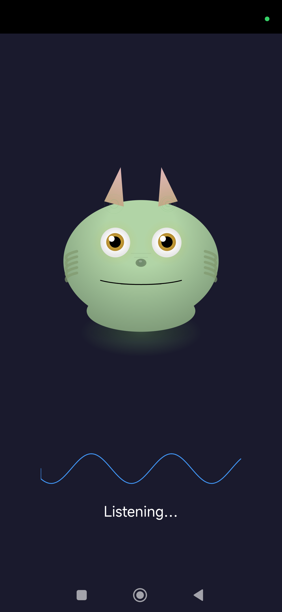

# Toadie Personal Assistant

Voice-to-Claude pipeline: Speak into your Galaxy Watch or phone (or just say "hey toadie"), Claude Code executes your command, and responses come back as text or TTS audio. Includes permission prompts for dangerous operations.

<p align="center">
  
  &nbsp;&nbsp;
  
</p>

- **Wear OS Watch App** — Record voice commands from your wrist, view chat history, approve/deny Claude tool permissions
- **Android Phone App** — Full companion app with animated creature (Toadie), chat interface, voice recording, and text input
- **Wake Word Detection** — Say "hey toadie" hands-free using [Picovoice Porcupine](https://picovoice.ai/platform/porcupine/) — always-on, on-device, low battery impact
- **Python Server** — HTTP + WebSocket server bridging apps to Claude Code, with permission hook for dangerous operations
- **Speech-to-Text & TTS** — Powered by [Deepgram](https://deepgram.com/) for fast transcription and natural voice responses
- **Permission System** — Dangerous tool calls (Bash, file writes) require approval from your watch or phone before Claude can proceed
- **Remote Access** — Works over [Tailscale](https://tailscale.com/) so you can talk to Claude from anywhere, not just your local network

## Architecture


Watch &rarr; Phone (Bluetooth/DataLayer) &rarr; Server (HTTP + WebSocket) &rarr; Deepgram (STT/TTS) + Claude Code &rarr; Response back

The watch has no direct network connection — all traffic relays through the paired phone via the Wearable DataLayer API.

## Setup

```bash
# Server dependencies
pip install deepgram-sdk aiohttp

# Deepgram API key
echo "your-api-key" > /tmp/deepgram_api_key

# Start server (pass your project directory)
./server.py /path/to/your/project
```

Server runs on HTTP `:5566` + WebSocket `:5567`. Dashboard at `http://localhost:5566`.

```bash
# Build and install apps
cd watch-app && ./gradlew assembleDebug && adb install -r app/build/outputs/apk/debug/app-debug.apk
cd phone-app && ./gradlew assembleDebug && adb install -r app/build/outputs/apk/debug/app-debug.apk
```

For wake word detection, add your [Picovoice](https://picovoice.ai/) access key to `phone-app/local.properties`:
```
porcupine.access_key=your-key-here
```

## Testing

```bash
pytest                             # All tests
curl http://localhost:5566/health  # Health check
```

## Troubleshooting

- **400 Bad Request** — Use `http://` not `https://`
- **No transcript** — Check Deepgram API key, verify audio format (m4a, wav, mp3)
- **Claude not responding** — Check `tmux attach -t claude-watch` or `tail -f /tmp/claude-watch.log`
- **Permission prompts missing** — Ensure phone app is connected via WebSocket
- **Watch can't connect** — Watch only needs to be paired with phone; phone needs server IP in settings
