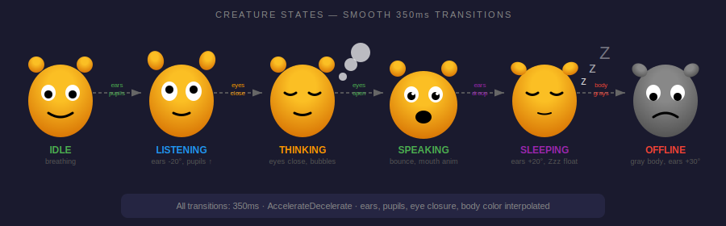

# Claude Companion

Android phone app with a Tamagotchi-style Claude creature, real-time chat, and permission prompt handling. Connects to the Claude Watch server via WebSocket for live updates.


## Features

### Animated Creature

Tamagotchi-style blob that reacts to Claude's state.



| State | Trigger | Animation |
|-------|---------|-----------|
| Idle | Default | Gentle breathing, occasional blinks |
| Listening | Audio received | Ears perked, attentive eyes |
| Thinking | Processing | Eyes closed, thought bubbles |
| Speaking | Response ready | Happy bounce, talking mouth |
| Sleeping | 2+ min idle | Zzz particles, closed eyes |
| Offline | Disconnected | Sad expression, gray color |

### Real-time Chat

- Messages appear instantly via WebSocket
- User messages: Blue bubbles (right-aligned)
- Claude messages: Orange bubbles (left-aligned)
- Auto-scroll to newest message
- Pending/failed message status indicators
- Retry failed messages on tap

### Input Methods

- **Text Input** - Type messages with keyboard
- **Voice Input** - Hold mic button to record, release to send

### Permission Prompts

When Claude needs approval for sensitive operations:
- Displays tool name and context
- Shows Allow/Deny options
- Sends decision to server
- Clears on resolution

### Kiosk Mode

Fullscreen immersive display mode:
- Hides status bar and navigation
- Triple-tap top-left corner to exit

## Requirements

- Android 8.0 (API 26) or higher
- Network access to Claude Watch server

## Setup

1. Build the app:
   ```bash
   cd phone-app
   ./gradlew assembleDebug
   ```

2. Install on phone:
   ```bash
   adb install -r app/build/outputs/apk/debug/app-debug.apk
   ```

3. Configure server address in Settings:
   - Tap the gear icon
   - Enter server IP and WebSocket port (e.g., `192.168.1.100:5567`)
   - Toggle Kiosk mode if desired
   - Tap Save

## Server Connection

The app connects via WebSocket for real-time updates:

```bash
# Server must be running
./server.py /path/to/project
```

### Endpoints Used

| Endpoint | Port | Description |
|----------|------|-------------|
| `ws://server:5567/ws` | 5567 | WebSocket for state & chat |
| `POST /api/message` | 5566 | Send text messages |
| `POST /transcribe` | 5566 | Send audio recordings |
| `POST /api/permission/respond` | 5566 | Submit permission decision |

### WebSocket Messages

**Received:**
| Type | Description |
|------|-------------|
| `state` | Claude status updates |
| `chat` | New chat message |
| `history` | Full chat history on connect |
| `permission` | Permission request |
| `permission_resolved` | Permission decision made |
| `usage` | Context usage stats |

**Connection:**
- Auto-reconnect on disconnect (5s delay)
- Ping/pong keepalive (30s interval)

## Project Structure

```
phone-app/
├── app/src/main/java/com/claudewatch/companion/
│   ├── MainActivity.kt           # Main UI + input handling
│   ├── SettingsActivity.kt       # Server config, kiosk toggle
│   ├── creature/
│   │   ├── CreatureView.kt       # Custom Canvas creature
│   │   └── CreatureState.kt      # State enum
│   ├── chat/
│   │   └── ChatAdapter.kt        # RecyclerView adapter
│   ├── network/
│   │   └── WebSocketClient.kt    # OkHttp WebSocket + StateFlow
│   └── kiosk/
│       └── KioskManager.kt       # Fullscreen mode
├── app/src/main/res/
│   ├── layout/
│   │   ├── activity_main.xml     # 40% creature / 60% chat split
│   │   ├── activity_settings.xml
│   │   ├── item_chat_user.xml    # Blue bubble
│   │   └── item_chat_claude.xml  # Orange bubble
│   └── values/
│       ├── colors.xml            # App color palette
│       └── themes.xml            # Dark theme
├── app/src/test/                  # Unit tests
└── build.gradle.kts
```

## Testing

```bash
# Run unit tests
./gradlew test
```

Tests cover:
- WebSocket message parsing
- ChatAdapter DiffUtil callback
- KioskManager tap detection
- CreatureState mapping

## Dependencies

- OkHttp 4.12.0 - WebSocket & HTTP
- Kotlin Coroutines - Async operations
- AndroidX RecyclerView - Chat list
- Material Components - UI elements

## Color Palette

| Element | Color |
|---------|-------|
| Background | `#1a1a2e` |
| Creature (light) | `#FBBF24` |
| Creature (dark) | `#D97706` |
| User bubble | `#0099FF` |
| Claude bubble | `#F59E0B` |
| Connected | `#4CAF50` |
| Disconnected | `#F44336` |
