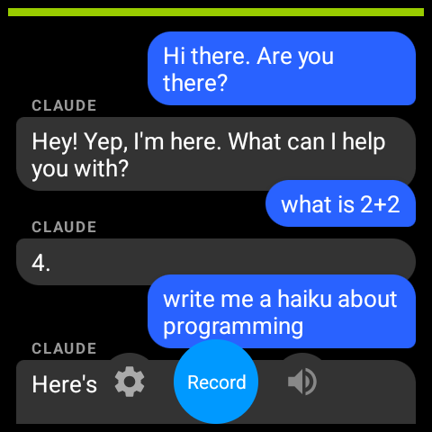
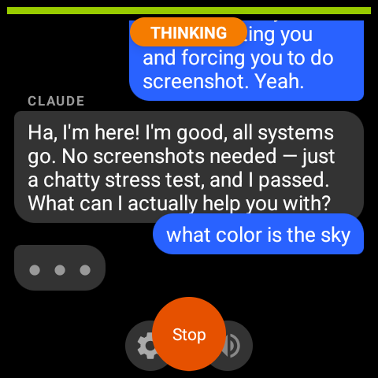
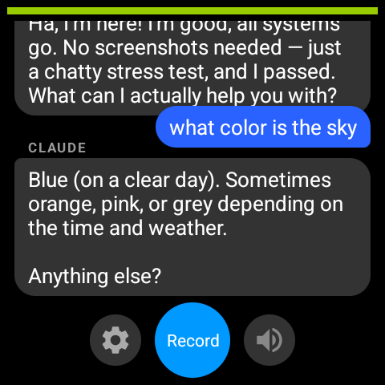

# Toadie — Wear OS Watch App

Voice recording app for Galaxy Watch that sends audio to the server and receives responses as text or audio. Connects through the phone app via Wearable DataLayer — no direct server connection needed.

<p align="center">
  
  &nbsp;
  
  &nbsp;
  
</p>

## Features

- **One-tap Recording** — Tap to record, tap to send
- **Real-time Chat** — View message history, scroll through conversations
- **Permission Prompts** — Approve/deny Claude tool calls with haptic feedback
- **Audio Playback** — Play/pause/replay TTS responses
- **Phone Relay** — All traffic goes Watch &harr; Phone (Bluetooth) &harr; Server (WebSocket)
- **Settings** — Configure server IP via phone app or on-watch settings

## States

| State | UI | Action |
|-------|-----|--------|
| Idle | "Record" button | Tap to start |
| Recording | "Stop & Send" (red) | Tap to send, or abort |
| Thinking | "Abort" + spinner | Waiting for Claude |
| Response | Chat message | Auto-scrolls to newest |
| Permission | Allow/Deny overlay | Approve or block tool call |

## Setup

```bash
./gradlew assembleDebug
adb install -r app/build/outputs/apk/debug/app-debug.apk
```

The watch doesn't need a server IP — just pair with the phone app. The phone handles the network connection.

## Testing

```bash
./gradlew test
```

## Requirements

- Galaxy Watch 4+ (Wear OS 3, API 30+)
- Toadie phone app installed and paired
