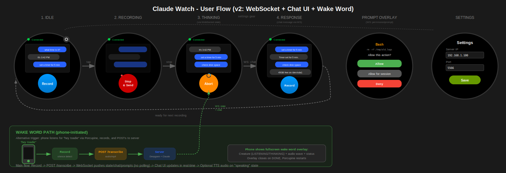

# Claude Watch - Wear OS App

Voice recording app for Galaxy Watch that sends audio to the claude-watch server and receives responses as text notifications or audio playback.

## UI Flow



## Features

- One-tap recording start/stop
- Direct HTTP POST to server
- Response polling with timeout handling
- Text notification display
- Audio response playback with controls
- Haptic feedback (vibration)
- Wake lock during operations
- Configurable server settings

## States

| State | UI | Actions |
|-------|----|----|
| Idle | "Record" button | Tap to start recording |
| Recording | "Stop & Send" (red) | Tap to send; Abort to cancel |
| Waiting | "Abort" + progress | Auto-polls for response; Tap to cancel |
| Playing | Play/Pause, Replay, Done | Control audio playback |

## Response Handling

The app polls `/api/response/<id>` after sending audio:
- **Polling interval:** 5 seconds
- **Initial delay:** 1.5 seconds
- **Max attempts:** 24 (2 minutes total)
- **Wake lock:** Held for up to 3 minutes

**Response modes:**
- `text` - Shows notification with response text
- `audio` - Downloads and plays MP3 audio
- `disabled` - No response expected

## Setup

### 1. Build

```bash
cd watch-app
./gradlew assembleDebug
```

### 2. Install on Watch

```bash
adb install -r app/build/outputs/apk/debug/app-debug.apk
```

Or use Android Studio with watch connected via ADB over WiFi.

### 3. Configure Server

Long-press the app icon or access Settings:
- **Server IP:** Your server's IP address (e.g., `192.168.1.100`)
- **Server Port:** HTTP port (default: `5566`)

## Usage

1. **Tap "Record"** - Starts recording (button turns red)
2. **Tap "Stop & Send"** - Stops recording and sends to server
3. **Wait** - App polls for Claude's response
4. **Receive** - Notification appears or audio plays

**Cancel anytime:** Tap "Abort" during waiting phase

## Endpoints Used

| Endpoint | Method | Purpose |
|----------|--------|---------|
| `/transcribe` | POST | Send audio recording |
| `/api/response/<id>` | GET | Poll for response |
| `/api/response/<id>/ack` | POST | Confirm receipt |
| `/api/audio/<id>` | GET | Download audio response |

## Audio Format

- **Format:** M4A (MPEG-4)
- **Codec:** AAC
- **Bitrate:** 128 kbps
- **Sample rate:** 44.1 kHz

Compatible with Deepgram API.

## Permissions

- `RECORD_AUDIO` - Voice recording
- `INTERNET` - HTTP requests
- `VIBRATE` - Haptic feedback
- `WAKE_LOCK` - Keep awake during polling
- `POST_NOTIFICATIONS` - Response notifications

## Requirements

- Galaxy Watch 4 or newer (Wear OS 3+)
- Android SDK 30+ (minSdk)
- Watch must be on same network as server

## Project Structure

```
watch-app/
├── app/src/main/java/com/claudewatch/app/
│   ├── MainActivity.kt      # Recording, polling, playback
│   └── SettingsActivity.kt  # Server configuration
├── app/src/main/res/
│   └── layout/
│       ├── activity_main.xml
│       └── activity_settings.xml
├── app/src/test/             # Unit tests
└── build.gradle.kts
```

## Testing

```bash
# Run unit tests
./gradlew test
```

Tests cover:
- State management and transitions
- Response parsing
- URL construction
- Polling configuration
